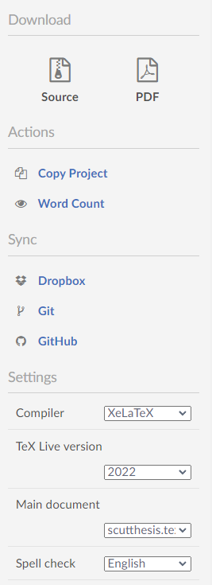
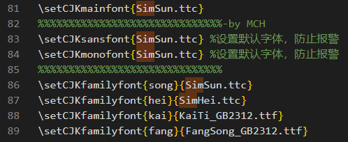

# 华南理工大学硕士学位论文 LaTeX 模板
> 在 [蒙超恒](https://github.com/mengchaoheng/SCUT_thesis) 大佬的项目上做了简单修改，可以在 `overleaf` 上直接编译。

## 注意点

+ 封面需要修改 `thesis_cover.doc` 另存为 `thesis_cover.pdf`, 放在本项目里。参考文献需要在网上查找 `Bibtex` 并填进 `MyLibrary.bib` 之后可以在正文引用。
+ 若在 `overleaf` 上直接编译，打开项目后点 `Menu -> Setting -> Compiler -> XeLatex` 设置编译器为 `XeLatex`，即可正常编译。另外，由于 `overleaf` 本身不支持中文字体 (`SimSun`, `SimHei`, `FangSong_GB2312`, `KaiTi_GB2312`)，本项目从网上找到这些字体并放在项目中。

+ 若在本地 windows 系统上编译，对于 `Texstudio` 同样需要 `选项 -> 设置 -> 构建 -> 默认编译器 -> XeLaTex` 设定。另外Windows下，除了 `KaiTi_GB2312` 外，其他字体均为系统自带。首先需要将 `KaiTi_GB2312.ttf` 放到 `C:\Windows\Fonts`，之后修改 `scutthesis.cls` 将 81-89 行的 `.ttc`, `.ttf` 去掉，从而使用系统自带的字体。

+ 在其他系统如 Linux, MacOS 编译，请查看 `tutorial/scutthesis说明.pdf` 或者 [蒙超恒](https://github.com/mengchaoheng/SCUT_thesis) 原项目下最新文档。
+ [蒙超恒](https://github.com/mengchaoheng/SCUT_thesis) 大佬说本项目最大的特点是基于 `Biber` 而不是 `BibTex`, 暂时未知异同。

> 本模板最主要的改动是参考文献使用biblatex（biber），而不是原来的BibTeX，因此不再需要.bst文件。在这项改动之后，参考文献部分的格式符合国标，当然要注意进行适当的设置，因为根据学校的论文撰写规范，有的信息是不需要显示在参考文献著录里的。可以查看biblatex包的[使用说明](https://github.com/mengchaoheng/SCUT_thesis/blob/master/settings_files/package_Documentation/biblatex-gb7714-2015.pdf)，[package_Documentation](https://github.com/mengchaoheng/SCUT_thesis/tree/master/settings_files/package_Documentation)文件夹还有其他包的使用说明。

